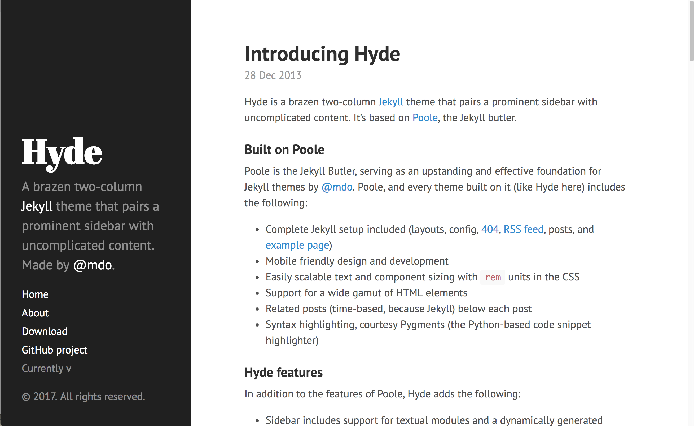
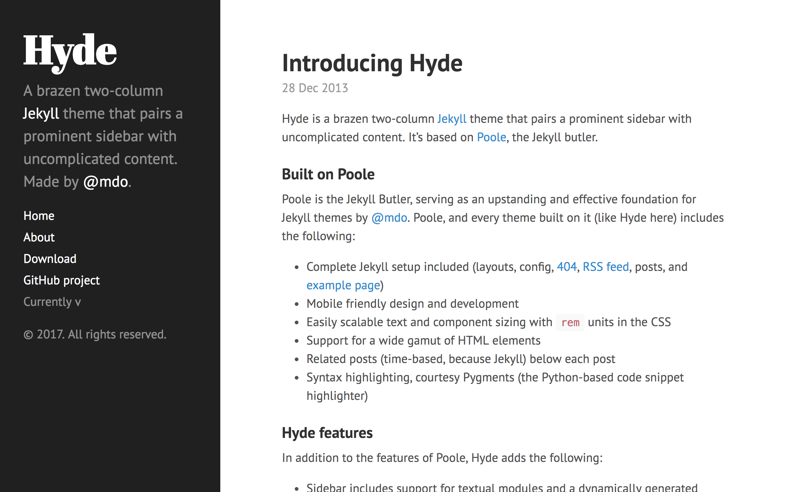
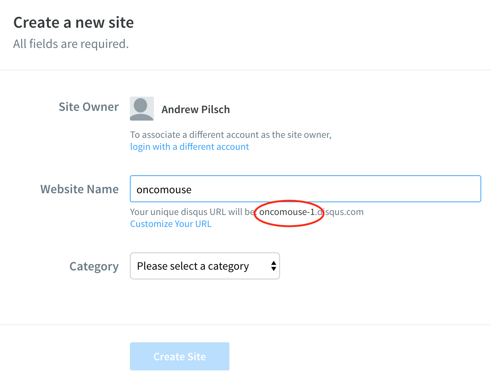

# Customizing Jekyll

## Updates

I found some bugs last night in both Hyde and Lanyon:

### Bug in Hyde

* In `_includes/sidebar.html`, the line: `<a href="{{ site.baseurl }}">` should read `<a href="{{ site.baseurl }}/">`

### Bug in Both Hyde & Lanyon

* In the file `index.html`, the line `{{post.content}}` should read `{{post.content | markdownify}}`

Check these if you are having problems.

## Changing Configuration Materials

Yesterday, we edited `_config.yml` to set the `url` and `baseurl` keys to the values we needed for our site.

There are some other configuration values you should set in the process of configuring your blog:

* `title` – The title for your site
* `tagline` – What appears after `title` in browser title and after the `title` in Lanyon.
* `description` – Copy that appears in the menu bar in both themes. Remember to use either single or double quotes around this value, if you are concerned about YAML acting weird.
* `author/name` and `author/url` – Should be set to you and a URL you want to associate with you (it could be this site).
* `paginate` – This value controls how many blog posts are displayed per page when on a blog index page

## Removing From or Adding To Navigation

*This section starts by talking about Hyde but addresses both themes after the first code block.*

Hyde has a few extra links in it's sidebar (to download the Hyde theme and to its GitHub). To remove these, you need to edit `_includes/sidebar.html`. Delete the lines toward the bottom of the file:

~~~html
<a class="sidebar-nav-item" href="{{ site.github.repo }}/archive/v{{ site.version }}.zip">Download</a>
<a class="sidebar-nav-item" href="{{ site.github.repo }}">GitHub project</a>
Currently v{{ site.version }}
~~~

Note the form these lines take, though. If you would like to link to another site (say your LinkedIn or Twitter) account, you could add the following:

~~~html
<a class="sidebar-nav-item" href="https://www.twitter.com/oncomouse">Find Me On Twitter</a>
~~~

And commit your sidebar. This is some very basic HTML that sets two properties on an anchor, `class` (which tells your browser how to display the element) and `href` (which tells your browser where the link goes).

## Customizing Your Theme

In this section will be making various changes to the styling of our Jekyll site.

**Important Note**: If you have committed the changes, your site has rebuilt, but you are still not seeing changes, you may have a problem with your browser caching an old version of the page.

To fix this, you need to do a *forced reload*. To do this in most browsers, hold down <kbd>Shift</kbd> on your keyboard and press the reload button in your browser (you can also hold down <kbd>Shift</kbd> while executing the reload shortcut (<kbd>Shift</kbd>+<kbd>Ctrl</kbd>+<kbd>R</kbd> on Windows; <kbd>Shift</kbd>+<kbd>Command</kbd>+<kbd>R</kbd> on macOS)).

### Changing Color

You can change the main color of the website using 8 pre-defined themes in both Lanyon and Hyde. To do so, first choose the theme you would like to use and copy the name (`theme-base-XX`) from the list below:

  * theme-base-08
  * theme-base-09
  * theme-base-0a
  * theme-base-0b
  * theme-base-0c
  * theme-base-0d
  * theme-base-0e
  * theme-base-0f
  

Now, edit the file `_layouts/default.html`. Find the HTML tag `<body>` in your document. Add a `class` attribute to it and set that to the name of your theme. For instance, if I wanted to use `theme-base-09`, I would edit my BODY tag to read `<body class="theme-base-09">`. Do not forget the quotes!

Save and commit the file. When the page has rebuilt, you should have a colorful site!

### Reversing Layout

If you would like the menu on the right of your site instead of on the left, you can do so by editing the file `_layouts/default.html`. Find the HTML tag `<body>` in that document. Add a `class` attribute to it and set it to `reverse-layout`. So, the body tag would become `<body class="reverse-layout">`.

If you set a theme in the section above, add both the theme name and `reverse-layout` to the class attribute but separate them by a space, so, for instance, `<body class="theme-base-09 reverse-layout">`.

Save and commit the file. When the page has rebuilt, you should have a reversed layout!

### Customizing the Menu (Hyde)

Hyde has one menu customization, the ability to make the content of the sidebar sticky to the bottom of the menu (which is the default) or sticky to the top. Basically, your choices are sticky:

Or non-sticky:

If you want to change from sticky to non-sticky, we need to edit `_includes/sidebar.html`. Change the line `
` to read `
`.

Commit your changes, wait for the site to rebuild, and you will have the non-sticky menu.

### Customizing the Menu (Lanyon)

Lanyon has two customizations to the menu:

1. Sidebar overlay instead of push
2. Sidebar open on load

### Sidebar overlay instead of push

In its default configuration, the menu in Lanyon will shift the content of the page over to the right when the menu opens. If you would instead prefer that the menu slide out over the content, without pushing it, you can do so by editing `_layouts/default.html`.

In that file, find the `<body>` tag (that you may have edited in the theme and layout reverse sections). Change it to read `<body class="sidebar-overlay">`. If you have added another class in changing the theme or reversing the layout, you will need to add `sidebar-overlay` separated by a space. So, with a theme, with layout reversed, and with overlay menu, the body tag might look like `<body class="theme-base-09 layout-reverse sidebar-overlay">`.

Commit the change, wait for the site to rebuild, and you should have an overlay menu.

### Sidebar open on load

If you prefer the menu to be open, edit the file `_includes/sidebar.html`. Find the line that reads `<input type="checkbox" class="sidebar-checkbox" id="sidebar-checkbox">` and change it by adding the word `checked` preceded by a space before the `>` character (so the line will read `<input type="checkbox" class="sidebar-checkbox" id="sidebar-checkbox" checked>`).

Commit the change, wait for the site to rebuild, and you should have a menu that is open by default.

## Adding Comments

As a static site, user comments are not a feature Jekyll supports out of the box. But that's ok, there is a service called [Disqus](https://disqus.com) that lets you add comments to any webpage, even static sites such as ours.

### Signing Up For Disqus

To add comments to your blog posts, we will first need to sign up for a Disqus. Go to [https://disqus.com/profile/signup/intent/](https://disqus.com/profile/signup/intent/) and choose "I want to install Disqus on my site". After you enter an email, your name, and a password, you will be taken to a screen to create your first Disqus site.

In the "Website Name" field, enter a name for your site (it doesn't matter what you choose). Below that field, Disqus will show you "Your unique disqus URL." The part before ".disqus.com" is your "short name" (I've circled it below). Copy this to your clipboard:

Choose a category for your site and press "Create Site."

On the next screen, about configuring your software, we are using Jekyll, but we are going to configure our site differently then they suggest, so click "3. Configure Disqus" in the sidebar of the site.

In the field labelled "Website URL," enter the URL of your website (`https://<username>.github.io`). Click on "Complete Setup." You can close Disqus now (but make sure you remember/have copied the short name we created).

### Adding Disqus to Your Site

Back on GitHub, we need to edit the file `layout/post.html`. Replace the contents of that file with:

~~~html
---
layout: default
---

Don't Edit Below this line.



  <h1 class="post-title">{{ page.title }}</h1>
  {{ page.date | date_to_string }}
  {{ content }}
  

  
  <noscript>Please enable JavaScript to view the <a href="https://disqus.com/?ref_noscript">comments powered by Disqus.</a></noscript>

  <h2>Related Posts</h2>
  <ul class="related-posts">
    
      <li>
        <h3>
          <a href="{{ post.url }}">
            {{ post.title }}
            <small>{{ post.date | date_to_string }}</small>
          </a>
        </h3>
      </li>
    
  </ul>

~~~

After you have pasted this in, change the line `` to replace `your-short-url` with what you copied as your Disqus short name earlier (leave the quotation marks).

At this point, you can save and commit this file.

You should now have commenting available on your site.
