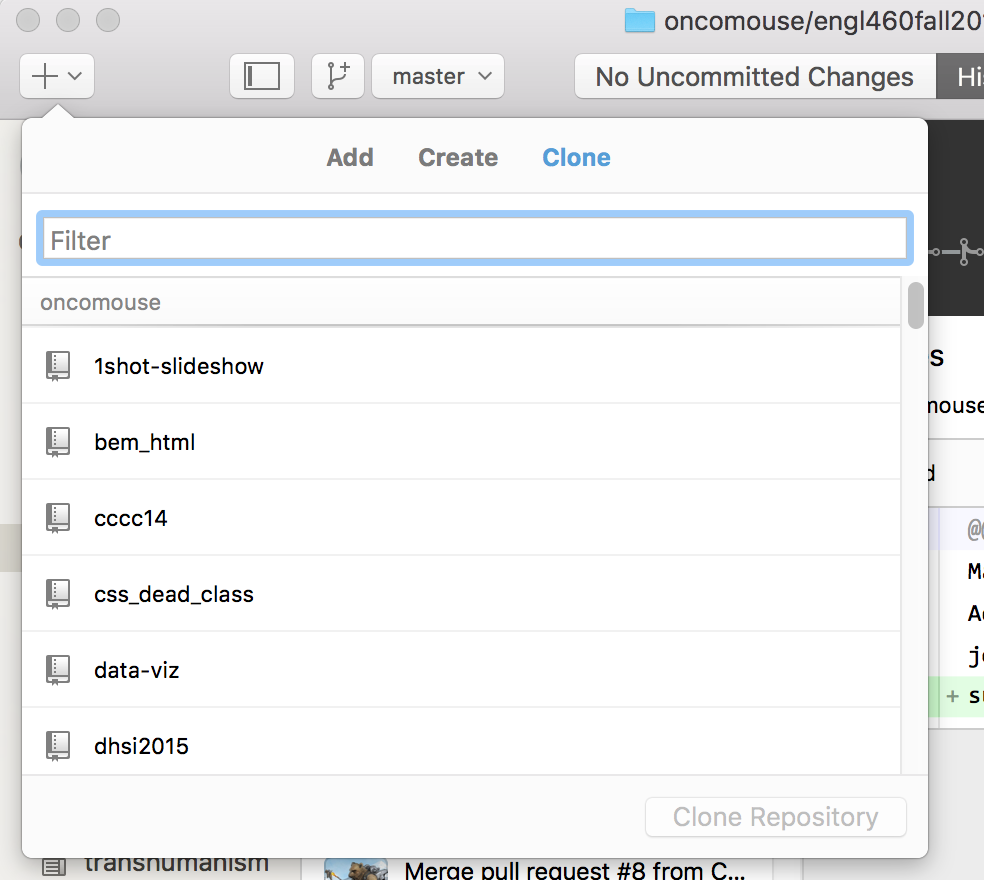
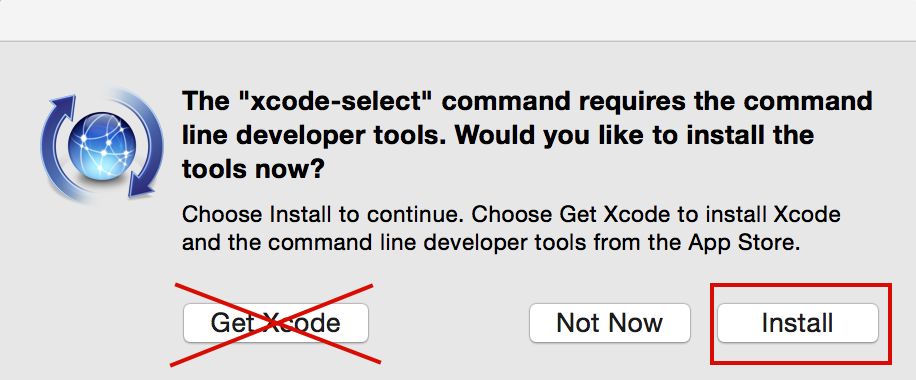
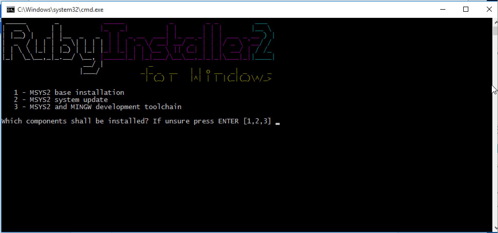

# Working Locally with Jekyll

You can debug a local copy of Jekyll before deploying your site to the public. This practice (work local, publish globally) is a best practice for any web writing, so that in case you break something, no one can see it.

However, to do so, we may have to go a bit outside our comfort zone. Jekyll is written in a programming language called Ruby. Ruby is invoked from a command line instead of a graphical user interface. We also have to use the command line to install some tools we will be using.

There are instructions below for macOS and Windows. Please follow your OS's instructions and then continue to the section entitled "Configuring Jekyll"

## Getting a Local Copy

To get started, you will need to clone your website's repository to your local computer, if you have not already done so. In GitHub Desktop, choose File->Clone on the menus at the top. In the list that pops up, filter it to find the `<username>.github.io` repository you have been working with this week.



Once that is finished, you can start installing Jekyll.

## Local Copy in macOS

We have to install a few tools for Jekyll to work. To access a command line on macOS, the program is called `Terminal`. It is located in the `Utilities` folder inside your `Applications` folder.

We have two tasks in this section:

1. Install Command Line Tools
2. Install Homebrew

### Install Command Line Tools

Copy the following code and paste it into the terminal. Then press <kbd>ENTER</kbd>:

```shell
xcode-select --install
```

The terminal will display the message `xcode-select: note: install requested for command line developer tools`, followed by a pop-up. In the pop-up, click "Install" but _do not_ click "Get Xcode":



You will see a message that "the software was installed" when this is finished.

### Install Homebrew

[Home Brew](http://brew.sh) is a package manager for macOS. It is used to install a variety of software packages, including Ruby.

To install Home Brew, copy the following code, paste it into a Terminal, and press <kbd>ENTER</kbd>:

~~~
/usr/bin/ruby -e "$(curl -fsSL https://raw.githubusercontent.com/Homebrew/install/master/install)"
~~~

The installer will ask you a bunch of questions, to which you can just press <kbd>ENTER</kbd>. Also, it will ask for your password, which you should enter when prompted.

When Home Brew is finished installing (it will take a bit), copy the following code, paste it into Terminal, and press <kbd>ENTER</kbd>:

~~~
brew install ruby
~~~

**You're done, please scroll down to "Configuring Jekyll" on this page**.

## Local Copy in Windows

To install Jekyll in Windows, we need to first install Ruby. To do so, go to [Ruby Installer for Windows](https://rubyinstaller.org) and click the "Download" button. From the list, choose either "Ruby-2.4.2-2 (x64)" or "Ruby-2.4.2-2 (x86)" depending on whether you have 64-bit or 32-bit Windows (x86 is 32-bit, they just like being confusing). When the file has finished downloading, run it.

When the installer opens, say you will accept the license and click "Next." Click the "Install" button on the next screen. When it is finished, make sure the box next to "Run 'ridk install' to install MSYS2 and development toolchain." is checked and click "Finish."

A command line window will appear (see below for what it looks like). Press <kbd>ENTER</kbd> on your keyboard.



A wizard will pop up labelled "MSYS 2." Follow the steps in the wizard. It takes a while to finish. If you are worried it is stuck, click "Show Details" to see that it is doing quite a bit.

When the Wizard is done, back in the original command line window, you should see a line that says `> pacman -Svu --needed --noconfirm`. This is MSYS2 needed to install some things. Press <kbd>ENTER</kbd> and it will run for a while.

It will ask you again which components to install but will display an empty set of square brackets (`[]`). Press <kbd>ENTER</kbd> and the window will close.

**You are ready to use Jekyll. Continue below!**

## Configuring Jekyll

Now that we have a working Ruby, we can begin to set Jekyll up.

If you have cloned your Jekyll repo using either GitHub Desktop or Git Kraken, you can open a command line directly in your repo. In GitHub Desktop, find the "Repository" menu and choose "Open in Command Prompt". In Git Kraken, find the "File" menu and choose "Open Terminal". You should now have a command line open in your repo's directory.

Copy the follow command, paste it into your command line, and press <kbd>ENTER</kbd>:

~~~
gem install jekyll bundler
~~~

Next, in your command line, run the following code:

~~~
bundle install
~~~

Now, we are ready to run Jekyll.

In the command line, run the following command (and remember it, you will be using it **a lot**):

~~~
bundle exec jekyll serve --incremental
~~~

Jekyll will display some information that looks something like this:

~~~
Configuration file: /Users/apilsch/Projects/lanyon/_config.yml
            Source: /Users/apilsch/Projects/lanyon
       Destination: /Users/apilsch/Projects/lanyon/_site
 Incremental build: enabled
      Generating...
                    done in 0.409 seconds.
 Auto-regeneration: enabled for '/Users/apilsch/Projects/lanyon'
    Server address: http://127.0.0.1:4000/lanyon/
  Server running... press ctrl-c to stop.
~~~

Note where it says "Server Address". The value after the colon and the space is a URL for your local Jekyll server (you're running a web server on your laptop!). It's probably [http://localhost:4000/](http://localhost:4000/), so you can click that link if it matches. Either way, open that URL in your web browser (don't forget the trailing slash; it matters to Jekyll).

You are now looking at a local copy of your website. As you change files in your text editor, Jekyll will rebuild the site. Reloading the page will display the most recent version.

However, the changes you make are local to your computer. You have to commit them and push them back to the master repo on GitHub's server before they will be live on the Internet.

Also, if a change you make isn't displaying, check the command line. Jekyll will tell you if you have any errors.

When you are finished working on your site for the moment, type <kbd>Ctrl+C</kbd> (hold down the <kbd>Control</kbd> key and press <kbd>C</kbd>) (and answer "Y" in Windows when it asks you to terminate batch job). Close the command line (quit the program, too, on macOS). You can pick back up again by reopening a command line and running `bundle exec jekyll serve --incremental` whenever you want to start again.
